# Dale inteligencia al Chatbot con Watson Assistant y mantenlo siempre activo con Kubernetes
[](https://nodei.co/npm/discord.js/)


## Resumen
En este Code Pattern extenderás las capacidades de tu bot de Discord dotándole de inteligencia con Watson Assistant para poder establecer un diálogo según lo configurado en el asistente virtual desplegado en IBM Cloud.
También asegurarás que tu bot está siempre activo desplegándolo en un cluster de Kubernetes 

## Tecnologias

- [Discord.js](https://discord.js.org/#/docs/main/stable/general/welcome)
- [Node.js](https://nodejs.org/en/docs/guides/getting-started-guide/)
- [Watson Assistant](https://cloud.ibm.com/docs/assistant?topic=assistant-getting-started)
- [Kubernetes] (https://cloud.ibm.com/docs/containers?topic=containers-getting-started)

Tiempo estimado: 30 minutos.

## Prerequisitos
- Contar con una cuenta de [IBM Cloud](https://cloud.ibm.com/), el plan Lite sirve para este Code Pattern.
- Contar con una cuenta registrada en la plataforma de [Discord](https://discord.com/), se recomienda tener el programa o la aplicación instalada para más rapida ejecución y debug.
- Contar con [Node.js](https://nodejs.org/en/download/) instalado en tu máquina, ya sea Linux, Windows o Mac.
- Contar con [Docker](https://www.docker.com/get-started) instalado en tu maquina, puedes usar también el software de Docker Desktop si es que no tienes muchas experiencia con Docker, aunque para este tutorial no será necesario saber mucho sobre esta tecnología.
- Tener desplegado un skill en [Watson Assistant](https://cloud.ibm.com/docs/containers?topic=containers-getting-started) con las intenciones, los diálogos y las entidades configuradas. 

## Descripción

El usuario de Discord agregará el bot a un servidor y mediante comandos podrá dialogar con él según lo configurado en Watson Assistant.
El bot se activa mediante un programa sencillo en Node.js el cual además permite invocará mediante llamadas al API del servicio de Watson Assistant desplegado en IBM Cloud que previamnente habremos configurado.

## Flow

<p align="center">
  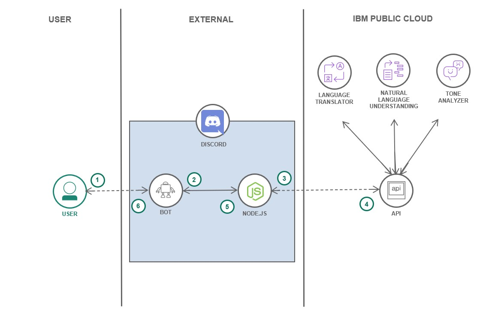</img>
</p>

-	El usuario interactúa con el bot en la plataforma Discord.
-	El bot utiliza la aplicación Node.js para recibir los comandos
- La aplicación se conteineriza y despliega como un pod en un cluster de Kubernetes
-	Dentro de la app Node.js se realizan las llamadas al API de Watson Assistant
-	Las respuestas de las APIs son recibidas y acomodadas por la app.
-	El bot entrega las respuestas al usuario en Discord.


## Instrucciones y Pasos

### 1. Registra un nuevo Bot en Discord Developers.

Para crear nuestro bot primero debemos registrar un nuevo bot en el sitio de Discord developers, esto permitirá generar un bot con nombre, descripción e imagen que represente lo que queremos crear, además de darle una entidad dentro de los servidores de Discord, para esto:

Primero, debes dirigirte a [Discord Developer Portal](https://discord.com/developers/applications) e iniciar sesión en el sitio, dentro de este deberías ver una opción para "New Application", haz clic en él como se aprecia en la imagen de abajo recalcado en el círculo rojo.

<p align="center">
  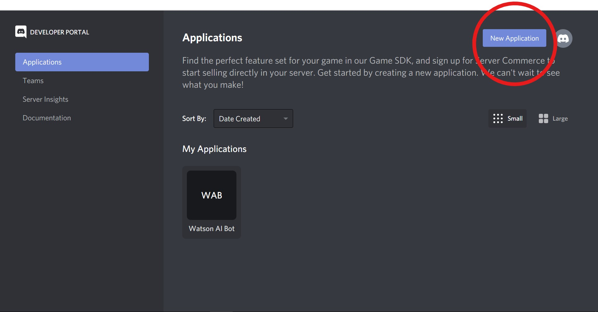</img>
</p>

Dale el nombre que quieras y haz clic en "Create".

<p align="center">
  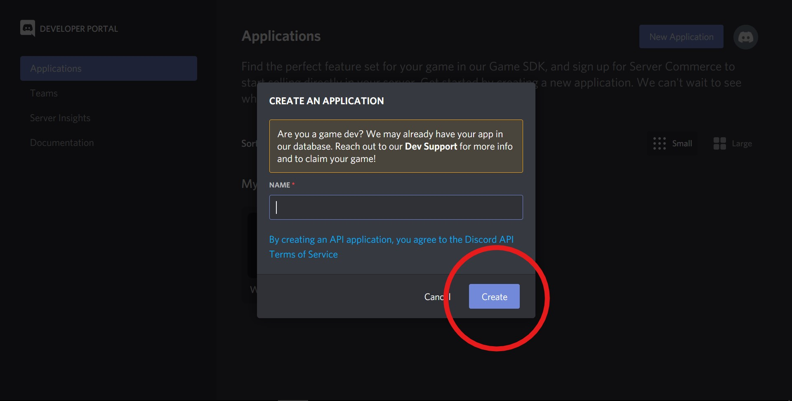</img>
</p>

Ahora deberías estar dentro de los settings de tu aplicación, en nuestro caso, el uso de esta aplicación será el "capullo" de nuestro bot, por lo tanto, podemos dar una descripción de lo que hará nuestro bot dentro de la descripción de la aplicación, luego para continuar, haz clic dentro de la opción "Bot".

<p align="center">
  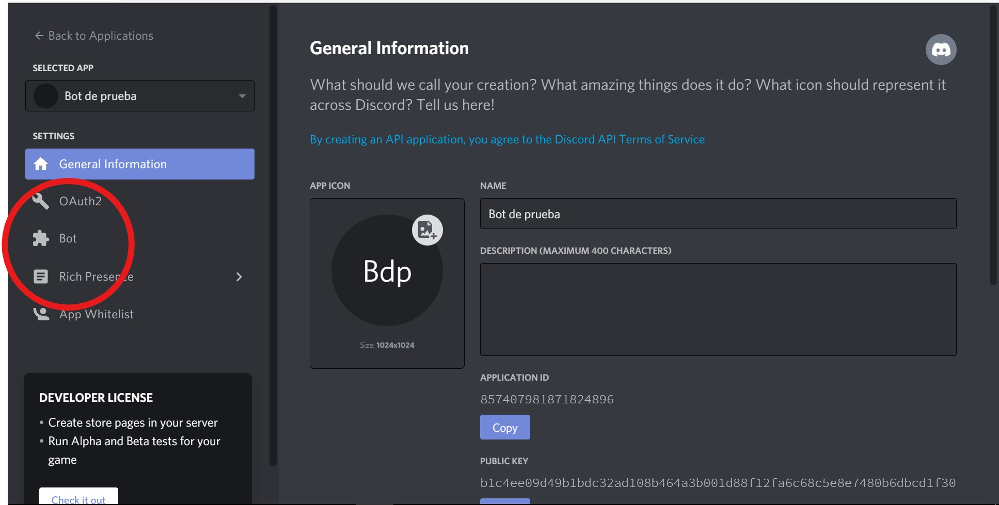</img>
</p>

Haz click en "Add Bot".

<p align="center">
  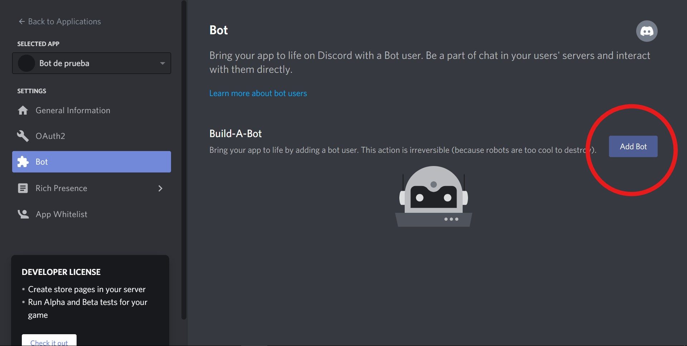</img>
</p>

Ahora ya cuentas con un bot registrado, dale el nombre que quieras (puede ser el mismo nombre que el de la aplicación, la verdad no hay mucha diferencia), coloca el icono que quieras y guarda los cambios. Para pasos posteriores, es **importante que guardes tu token personal del bot**, este token es el que va a permitir controlar y manejar tu bot, es confidencial solo para ti.

<p align="center">
  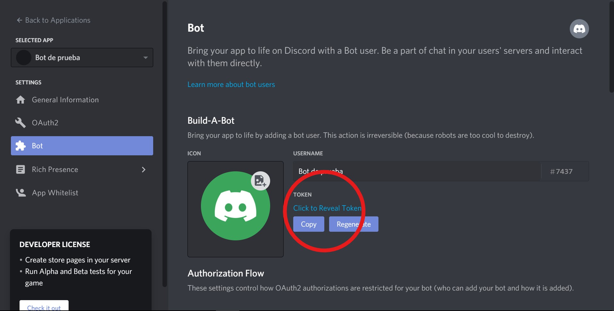</img>
</p>

------------------------------------------------------------------------------------------------------------

### 2. Añade el Bot a un servidor.

Aún nuestro bot no hace nada, pero pronto lo hará, por ahora ya que tenemos registrado el bot podemos añadirlo a un servidor para comenzar a darle características, puedes agregarlo al servidor que tú quieras, pero recomiendo que al inicio lo agregues a un servidor de pruebas para que puedas ir probando sus comandos de forma más cómoda, para esto, debemos hacer lo siguiente:

Visita la [Calculadora de Permisos de Discord](https://discordapi.com/permissions.html), dentro de ellas seleccionaremos todos los permisos, no te preocupes por temas de seguridad y privacidad, nuestro bot solo realizará respuestas a consultas, no tendrá facultades para realizar más acciones que solo responder a textos (aunque él lo quiera).

<p align="center">
  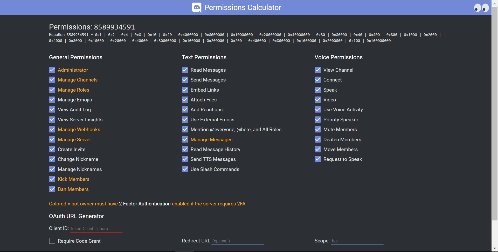</img>
</p>

Luego, vuelve al sitio de los settings de tu aplicación en el Discord Developer Portal, dirígete a "General Information" y copia tu "APPLICATION ID"

<p align="center">
  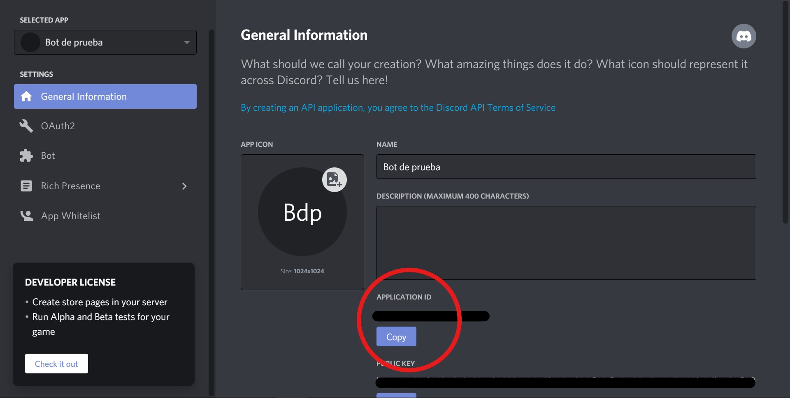</img>
</p>

Ahora pega este ID dentro de la Calculadora de Permisos de Discord.

<p align="center">
  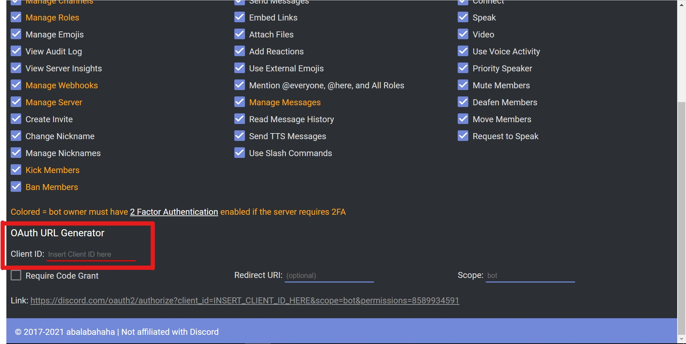</img>
</p>

Hecho esto, ya tienes listo tu enlace propio (y enlace para compartir) para permitir que tu bot entre a tu servidor y al que tú quieras, ingresa al enlace, selecciona el servidor que quieras, y dale a "Continuar"

<p align="center">
  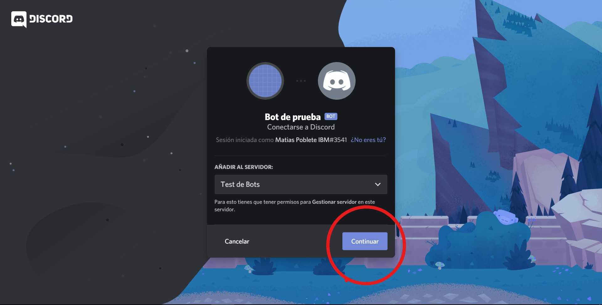</img>
</p>

A continuación, acepta los permisos otorgados al bot haciendo clic en "Autorizar" (Recuerda que el bot solo puede responder comandos que ya están programados, y esto solo contempla llamadas a APIs, por lo tanto, no puede comprometer la privacidad ni seguridad de ningún servidor)

<p align="center">
  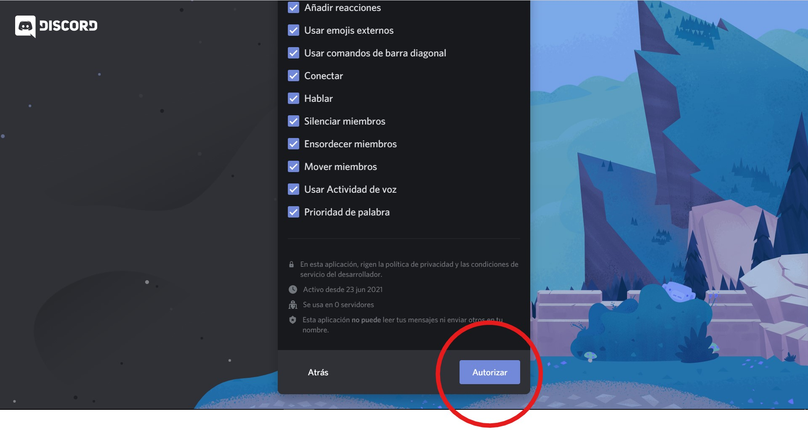</img>
</p>

Si hiciste todo lo anterior, felicidades, ¡ya tienes tu bot (vacío aún) dentro de tu servidor!

<p align="center">
  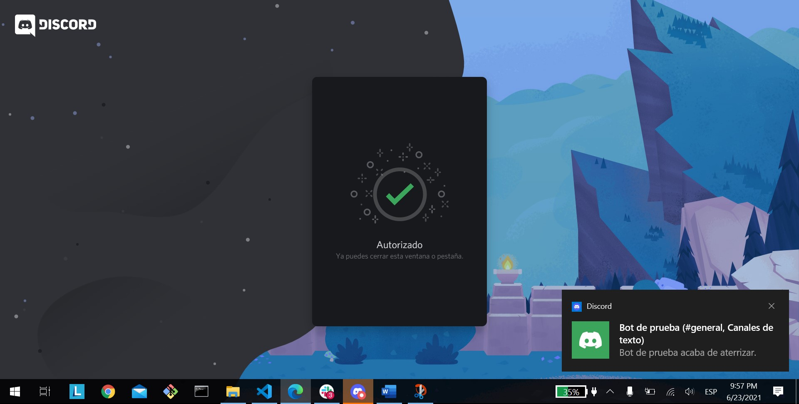</img>
</p>

Puedes revisar este video en inglés que recopila todo este proceso: [Code Your Own Discord Bot](https://www.youtube.com/watch?v=j_sD9udZnCk) créditos al canal de Codelyon en Youtube.

------------------------------------------------------------------------------------------------------------

### 3. Démosle inteligencia al bot con la aplicación Node.js

Ahora vamos a construir nuestro bot para que funcione como un chatbot inteligente integrado con Watson Assistant, para esto debes hacer lo siguiente:

Clona este repositorio en una consola de comandos o bash:

```
git clone https://github.com/luisreyesoliva/Discord-Watson-AI-Bot
```
Entra en la carpeta del proyecto:

```
cd Discord-Watson-AI-Bot/watson-assistant
```
Ya dentro de esta carpeta encontramos todo lo necesario para dar inteligencia al bot.
El archivo "watbot.js" es el que orquesta las funciones del bot, está escrito en Node.js e incluye las llamadas al API de Watson Assistant.
También verás un Dockerfile que nos permitirá generar la imagen de contenedor con todos los recursos necesarios para poder ejecutar nuestro bot. 

Las funciones inteligentes ya se encuentran programadas, solo debes darle acceso a ellas a través del servicio de Watson Assistant que debes tener creado y configurado previamente, con sus intenciones, entidades y diálogos. 
Para configurar las conexiones al servicio, abre y modifica el archivo ".env" copiando las credenciales de acceso necesarias (API Keys y Service Url) de tu recurso de Watson Assistant y pegandolas en los campos indicados.
Además, copiar y pega el token de tu bot que se muestra en el paso **1. Registra un nuevo Bot en Discord Developers**, si te queda alguna duda de cómo conseguir estos accesos, consulta la documentación en **Tecnologías**.

<p align="center">
  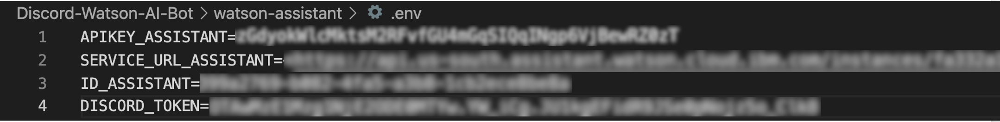</img>
</p>

Teniendo todo lo anterior listo, podemos proceder a construir la imagen completa de los recursos de nuestro bot con Docker, como ves, no hay nada de programación hasta ahora, y tampoco habrá, ya que los comandos ya están programados anteriormente, de los cuales te contaré más después de ejecutar el bot.

Para construir la imagen del bot, en la raíz del proyecto clonado ejecutaremos lo siguiente.
Tagea el nombre de la imagen con el formato 'repositorio/imagen:versión' donde 'repositorio' es un repositorio válido de Dockerhub donde subiremos la imagen:

```
docker build -t <NOMBRE-IMAGEN-BOT> .
```

Esperamos su construcción y subimos la imagen a Dockerhub.

```
docker push <NOMBRE-IMAGEN-BOT>
```

### 4. Desplegando la aplicación en Kubernetes

Ahora vamos a desplegar la aplicación en Kubernetes para que nuestro bot esté permanente activo en Discord y no se nos caiga, además podemos escalarlo en caso de que la demanda de interacciones crezca mucho. 

Para ello debemos contar previamente con un cluster de Kubernetes ya aprovisionado en IBM Cloud.

Primero configuraremos el acceso, para ello:

- Logate en [IBM Cloud](https://cloud.ibm.com) para acceder al Dasshboardo.
- Haz click en el icono de terminal (arriba a la derecha) para lanzar **IBM Cloud Shell**.

```text
ibmcloud ks clusters
```
- Configura la cli de `kubectl` para que acceda a tu cluster (indica el nombre de tu cluster).

```text
ibmcloud ks cluster config --cluster <tu cluster>
```

- Verifica que tienes accesso al API de Kubernetes.

```text
kubectl get namespace
```

Debería obtener todos los namespaces activos si todo ha ido bien.

```text
NAME              STATUS   AGE
default           Active   125m
ibm-cert-store    Active   121m
ibm-system        Active   124m
kube-node-lease   Active   125m
kube-public       Active   125m
kube-system       Active   125m
```

Ahora crearemos los recursos necesarios en K8s para que nuestra aplicación se ejecute y con ello arranque el bot en Discord. 

Para ello modifica el archivo "deployment.yaml" para indicar el mombre de la imagen que creaste en el paso anterior y que ya deberías tener subida al registro de Docker. 
Sustituye en el campo 'image' <NOMBRE-IMAGEN-BOT> por el nombre de la imagen que has creado.

```
image: <NOMBRE-IMAGEN-BOT>
```

Ya estamos casi! solo te queda crear el deployment y el servicio en K8s.

- Crea el deployment `wat-bot` 

```text
kubectl create -f deployment.yaml
```

- Y por último crea el servicio `wat-bot` para exponer nuestro pod hacia fuera del cluster.

```text
kubectl create -f service.yaml
```

Si todo salió bien, deberías ver que tu bot se encuentra en estado de conectado en el servidor de Discord, como se ve en esta imagen.

<p align="center">
  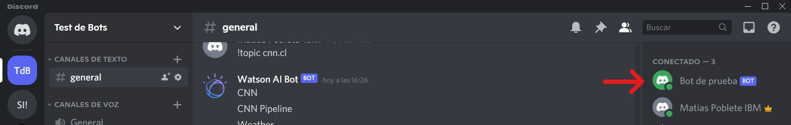</img>
</p>

Ahora nuesto bot se encuentra completamente listo para ser usado.
Para interactuar con Watson assistant, deberás preceder el mensaje con el prefijo "!wa". Así el bot sabrá que tiene que invocar a Watson Assistant.

Prueba tus dialogos y disfruta de tu nuevo bot! 


## Licencia

Este Code Pattern se encuentra licenciado bajo Apache License, Version 2. Objetos de código de terceros invocados en dentro de este Code Pattern se encuentran licenciados bajo sus respectivos proveedores en conformidad con los términos de sus correspondientes licencias. Todas las contribuciones se encuentran sujetas al [Developer Certificate of Origin, Version 1.1](https://developercertificate.org/) y la [Apache License, Version 2](https://www.apache.org/licenses/LICENSE-2.0.txt).

[Preguntas frecuentes sobre Apache License](https://www.apache.org/foundation/license-faq.html#WhatDoesItMEAN)
